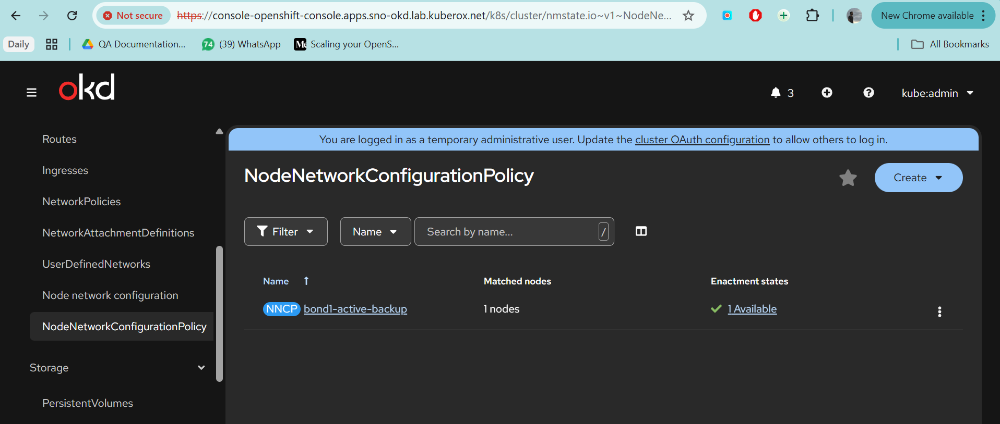
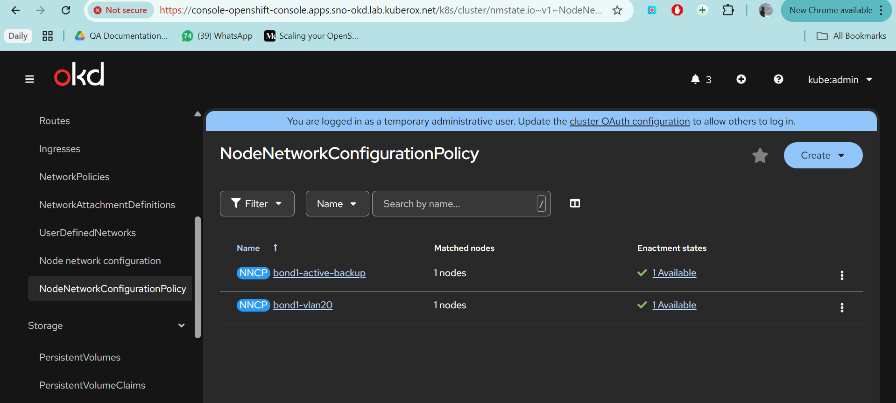
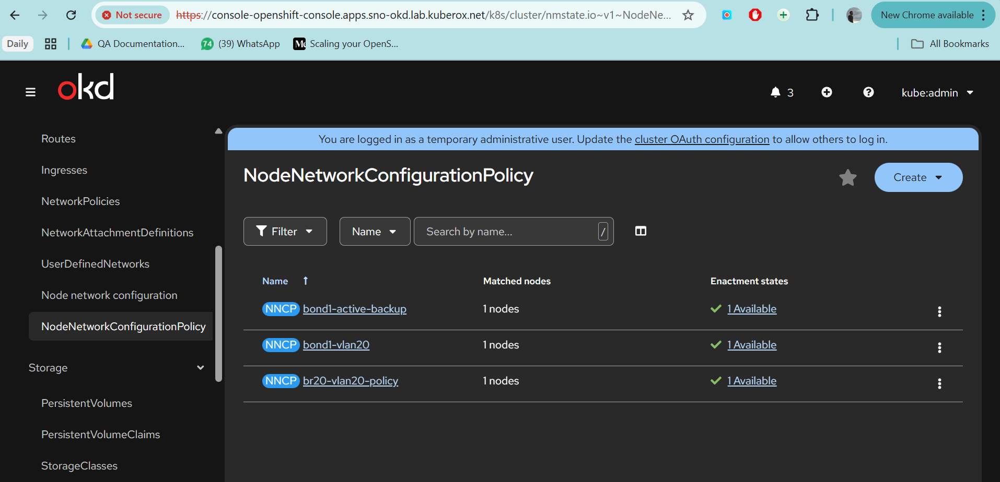
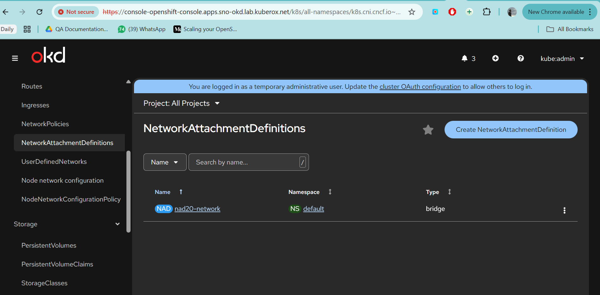
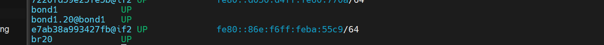

```
You’re on bare-metal servers (not VMs), running OpenShift Virtualization + MTV, and you already:

Use eno1 + eno2 → bonded/VLANed → OCP cluster traffic

Want to use eno3 + eno4 → Virtualization / VM networks (br-ex, VLANs 10/20/30/40)

You’re asking the right question:

Do I really need bond + VLAN on eno3/eno4 or can I use them directly?

Let’s go step-by-step, slowly and clearly, and I’ll also teach the why, not just the YAML.

1️⃣ First: Understand the Network Roles (Very Important)

Think in layers:

🧱 Layer 1 – Physical NICs

eno1, eno2 → already used by OCP cluster

eno3, eno4 → free NICs (good 👍)

🧱 Layer 2 – Bond (optional but recommended)

Combines NICs for:

redundancy (NIC failure)

better throughput

🧱 Layer 3 – VLAN (depends on your switch)

Needed ONLY IF:

Your switch ports are trunk ports

You want multiple isolated networks on same NICs

🧱 Layer 4 – Linux Bridge

Needed for OpenShift Virtualization

VMs connect to bridges, not directly to VLANs

🧱 Layer 5 – NAD

Exposes the bridge to Pods/VMs
```
```
Recommended Architecture (BEST PRACTICE)

eno3 ─┐
      ├─ bond1 (active-backup)
eno4 ─┘
         │
         ├─ bond1.10 → br10 → NAD → VM Network
         ├─ bond1.20 → br20 → NAD → VM Network
         ├─ bond1.30 → br30 → NAD → VM Network
         └─ bond1.40 → br40 → NAD → VM Network

This is exactly what Red Hat expects for bare-metal virtualization.
```
```
3️⃣ Step-by-Step: What You SHOULD Do (Clean Order)
🔹 STEP 0 – Verify NICs on Workers

oc debug node/<worker-name>
chroot /host
nmcli device status

Confirm:
eno3 → connected / up
eno4 → connected / up 
NOT used by OCP
``` 
```
🔹 STEP 1 – Create Bond (eno3 + eno4)
Why?
NIC failover
Stable base for VLANs
Bond NNCP: 

apiVersion: nmstate.io/v1
kind: NodeNetworkConfigurationPolicy
metadata:
  name: bond1-active-backup
spec:
  desiredState:
    interfaces:
      - name: bond1
        type: bond
        state: up
        link-aggregation:
          mode: active-backup
          options:
            miimon: "100"
            primary: eno3
          port:
            - eno3
            - eno4
  nodeSelector:
    node-role.kubernetes.io/worker: ""


oc apply -f bond1.yaml

✅ Wait until Policy status = Available
```

```
🔹 STEP 2 – Create VLANs on Bond
Example: VLAN 20

apiVersion: nmstate.io/v1
kind: NodeNetworkConfigurationPolicy
metadata:
  name: bond1-vlan20
spec:
  desiredState:
    interfaces:
      - name: bond1.20
        type: vlan
        state: up
        vlan:
          base-iface: bond1
          id: 20
  nodeSelector:
    node-role.kubernetes.io/worker: ""


Repeat for:
bond1.20
bond1.30
bond1.40

⚠️ Only do VLANs if your switch ports are trunk ports
```

```
🔹 STEP 3 – Create Linux Bridges (VM attachment)
Example: VLAN 20 → Bridge br20

apiVersion: nmstate.io/v1
kind: NodeNetworkConfigurationPolicy
metadata:
  name: br20-vlan20-policy
spec:
  desiredState:
    interfaces:
      - name: br20
        type: linux-bridge
        state: up
        bridge:
          port:
            - name: bond1.20
          options:
            stp:
              enabled: false
  nodeSelector:
    node-role.kubernetes.io/worker: ""

Repeat for:
br20 → bond1.20
br30 → bond1.30
br40 → bond1.40
```

```
🔹 STEP 4 – Create NAD (One per Bridge)
Example: NAD for br30

apiVersion: k8s.cni.cncf.io/v1
kind: NetworkAttachmentDefinition
metadata:
  name: nad20-network
  namespace: default
spec:
  config: |
    {
      "cniVersion": "0.4.0",
      "name": "br20-net",
      "type": "bridge",
      "bridge": "br20",
      "macspoofchk": false,
      "ipam": {
        "type": "static",
        "addresses": [
          {
            "address": "190.170.20.0/23",
            "gateway": "190.170.20.1"
          }
        ]
      }
    }

```


```

🔹 STEP 5 – Verify Everything
oc get nncp
oc get nnce
oc get nad

On node:
ip link show bond1
ip link show bond1.10
ip link show br10

```

```
5️⃣ Final Recommendation (Clear Verdict)
✅ What YOU should do:

✔ Bond eno3 + eno4

✔ Create VLANs on bond

✔ Create bridges per VLAN

✔ Use NADs for VM attachment

✔ Keep eno1/eno2 isolated for OCP

❌ What NOT to do:

Don’t mix OCP traffic and VM traffic

Don’t attach VMs directly to NICs

Don’t skip bridges
```